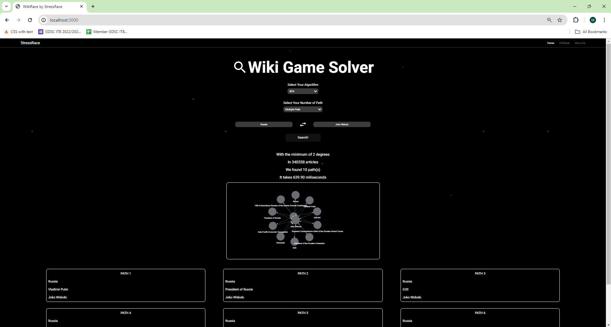

# Tubes2_StressRace
> A simple web project that determines the shortest path between two Wikipedia articles using Breadth-First Search (BFS) and Iterative Deepening Search (IDS) algorithms.

## Table of Contents
* [General Info](#general-information)
* [Team Members](#team-members)
* [Technologies Used](#technologies-used)
* [Features](#features)
* [Screenshots](#screenshots)
* [Setup](#setup)
* [Usage](#usage)
* [Room for Improvement](#room-for-improvement)


## General Information
WikiRace is a game designed to find the shortest path between two Wikipedia articles. This web-based project facilitates the search using either the Breadth-First Search (BFS) or Iterative Deepening Search (IDS) algorithms. Users can input the starting and target Wikipedia titles, choose the algorithm to use, and specify whether they seek a single solution or multiple solutions. Iterative Deepening Search (IDS) is a search algorithm that works by  repeatedly executing a depth-limited version of depth-first search (DFS), increasing the depth limit with each iteration until it finds the solution. Breadth-First Search (BFS) is a search algorithm that traverses a graph level by level, commencing from a root node and extending outward to all adjacent nodes. In this project, BFS utilizes a queue to manage nodes to be visited next.

## Team Members
| **NIM**  |       **Nama**           |
| :------: | :----------------------: |
| 13522038 | Francesco Michael Kusuma |
| 13522075 |    Marvel Pangondian     |
| 13522112 |  Dimas Bagoes Hendrianto  |

## Technologies Used
- Go (Gin) 
- Docker
- React JS
- Next JS
- Tailwind CSS


## Features
- Find a single shortest path between two Wikipedia links using either the Iterative Deepening Search (IDS) or Breadth-First Search (BFS) algorithm.
- Find all shortest paths between two Wikipedia links using either the IDS or BFS algorithm.
- Docker support for building the application.


## Setup

Make sure your golang version is appropriate. try running `go version`, if not found, it means your Golang installation is not correct. Required version 1.21.6 or higher. You can install go from this [Go](https://go.dev/doc/install)

To run this repository locally, ensure you have Node.js and npm installed. If you haven't installed them yet, you can follow the instructions provided in this [link](https://docs.npmjs.com/downloading-and-installing-node-js-and-npm).

- Clone this project
```
git clone https://github.com/FrancescoMichael/Tubes2_StressRace
```

- Install frontend dependencies
<br>from root project, run command :

```
cd src/client
npm install
```
- Install backend dependencies
<br>from root project, run command :

```
cd src/server
go mod download
```

## Usage
### Usage with docker
To run this project using Docker, you first need to install Docker on your machine. Follow the instructions provided in the official [Docker](https://docs.docker.com/) documentation to download and install Docker. Once Docker is up and running, execute the following command in the root directory of the project:
```
docker-compose up --build
```
After the build process is complete, access the web application by navigating to  to [localhost:3000](http://localhost:3000/) in your browser


### Usage without docker
To run this project without Docker, First you need to run the backend, from root project folder, run this command: 
```
cd src/server/cmd/app
go run main.go
```
open another terminal in your project folder, and run the frontend

```
cd src/client
npm run dev
```
after both backend and frontend are up and running, access the web application by navigating to  to [localhost:3000](http://localhost:3000/) in your browser

## Screenshots
<br/><br/><br/>
<br/><br/><br/>
<br/><br/><br/>
<br/><br/><br/>
<br/><br/><br/>
<br/>

## Room for Improvement
Room for improvement:
- Better Breadth-First Search (BFS) and Iterative Deepening Search (IDS) algorithms
- Explore methods to reduce memory consumption in BFS


To do:
- Video Example
  
